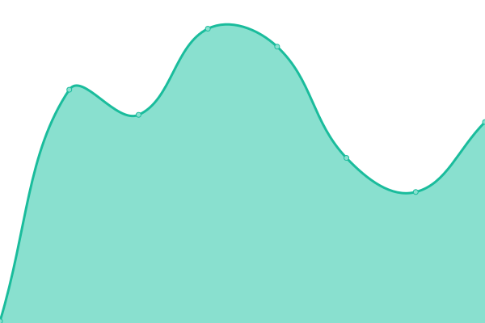

# [📈 Live Status](https://Lwnlcks.github.io/namgall-status): <!--live status--> **🟧 Partial outage**

This repository contains the open-source uptime monitor and status page for [Lwnlcks](https://sona.wiki/), powered by [Upptime](https://github.com/upptime/upptime).

With [Upptime](https://upptime.js.org), you can get your own unlimited and free uptime monitor and status page, powered entirely by a GitHub repository. We use [Issues](https://github.com/Lwnlcks/namgall-status/issues) as incident reports, [Actions](https://github.com/Lwnlcks/namgall-status/actions) as uptime monitors, and [Pages](https://Lwnlcks.github.io/namgall-status) for the status page.

<!--start: status pages-->
<!-- This summary is generated by Upptime (https://github.com/upptime/upptime) -->
<!-- Do not edit this manually, your changes will be overwritten -->
<!-- prettier-ignore -->
| URL | Status | History | Response Time | Uptime |
| --- | ------ | ------- | ------------- | ------ |
|  [namuwiki-gall](https://gall.dcinside.com/mgallery/board/lists?id=namuwiki) | 🟩 Up | [namuwiki-gall.yml](https://github.com/Lwnlcks/namgall-status/commits/HEAD/history/namuwiki-gall.yml) | 

 2076ms
     
 | 

<a href="https://Lwnlcks.github.io/namgall-status/history/namuwiki-gall">100.00%</a>
    

|  [namgall-wiki](https://namgall.wikiing.in/) | 🟥 Down | [namgall-wiki.yml](https://github.com/Lwnlcks/namgall-status/commits/HEAD/history/namgall-wiki.yml) | 

 68ms
     
 | 

<a href="https://Lwnlcks.github.io/namgall-status/history/namgall-wiki">0.00%</a>
    

<!--end: status pages-->

[**Visit our status website →**](https://Lwnlcks.github.io/namgall-status)

## 📄 License

- Powered by: [Upptime](https://github.com/upptime/upptime)
- Code: [MIT](./LICENSE) © [Lwnlcks](https://sona.wiki/)
- Data in the `./history` directory: [Open Database License](https://opendatacommons.org/licenses/odbl/1-0/)
